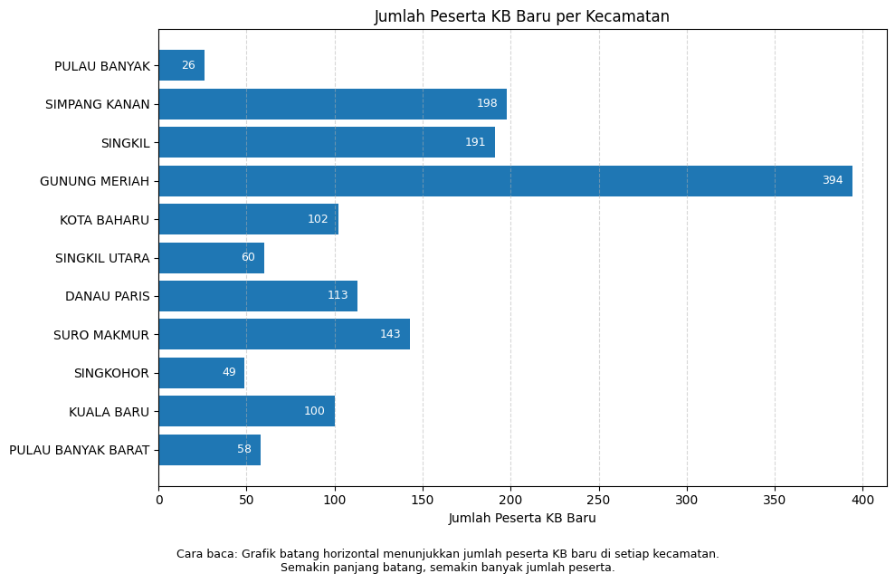
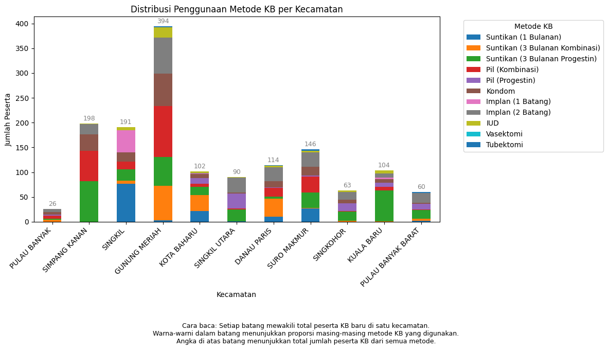
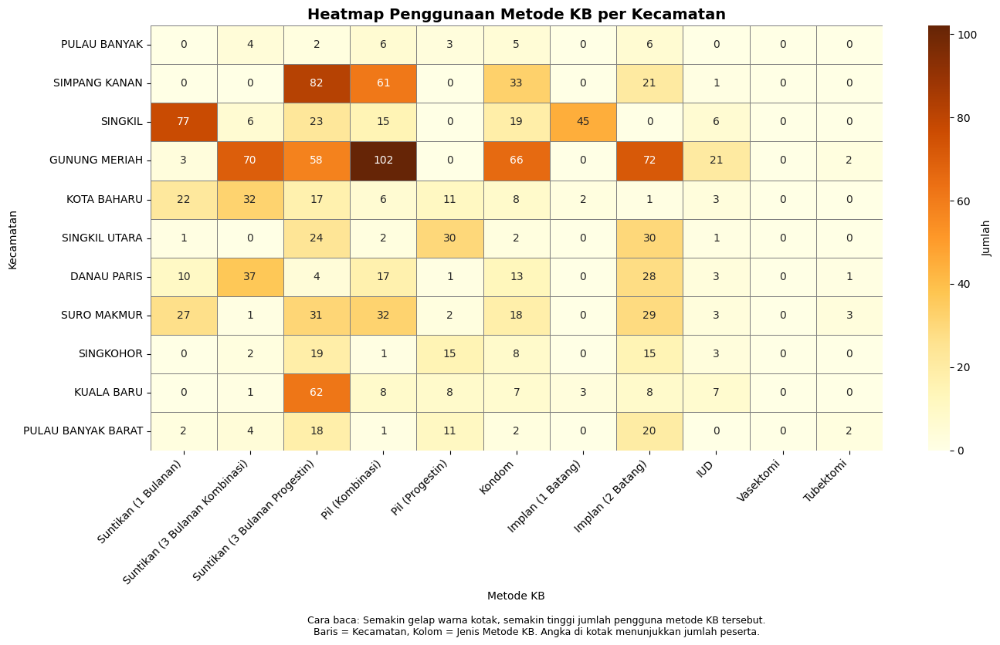

# 📊 Visualisasi Data Peserta KB Baru per Kecamatan

Proyek ini bertujuan untuk menganalisis dan memvisualisasikan data jumlah peserta KB baru serta distribusi metode kontrasepsi yang digunakan di berbagai kecamatan.

## 🔍 Deskripsi Singkat

Dataset berisi jumlah peserta KB baru dan rincian penggunaan metode kontrasepsi per kecamatan. Visualisasi dilakukan menggunakan Python, pandas, matplotlib, dan seaborn. Tiga jenis grafik dihasilkan:

1. **Bar Chart Horizontal**: Menunjukkan jumlah peserta KB baru di setiap kecamatan.
2. **Stacked Bar Chart**: Menggambarkan distribusi metode KB di tiap kecamatan.
3. **Heatmap**: Memvisualisasikan intensitas penggunaan metode KB antar kecamatan.

## 📁 Struktur Folder

```
output_kb_baru_kumulatif/
│
├── peserta_kb_baru_per_kecamatan.png
├── stacked_metode_kb_per_kecamatan.png
└── heatmap_metode_kb.png
```

## 📷 Contoh Visualisasi

### Jumlah Peserta KB Baru per Kecamatan



### Distribusi Metode KB (Stacked Bar)



### Heatmap Penggunaan Metode KB



## 🛠️ Tools & Library

* Python 3.x
* pandas
* matplotlib
* seaborn
* os

## 🧠 Cara Kerja

1. Membaca dan menyiapkan data dalam format dictionary → DataFrame.
2. Membuat tiga jenis visualisasi untuk menganalisis distribusi jumlah peserta dan metode KB.
3. Menyimpan grafik ke dalam folder `output_kb_baru_kumulatif`.

## 📌 Catatan

* Visualisasi cocok digunakan untuk laporan analisis program KB di tingkat kecamatan.
* Dapat dikembangkan untuk dashboard interaktif atau integrasi dengan data real-time.
