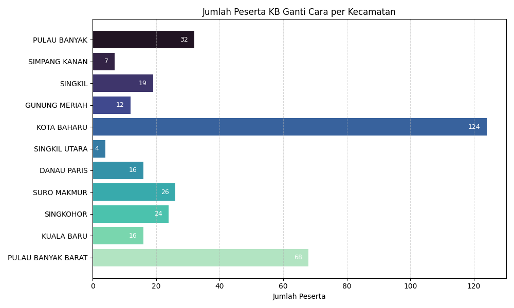
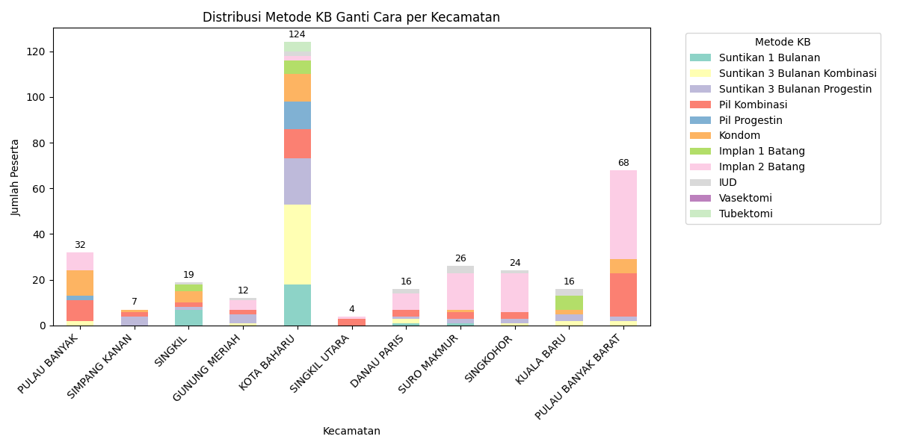
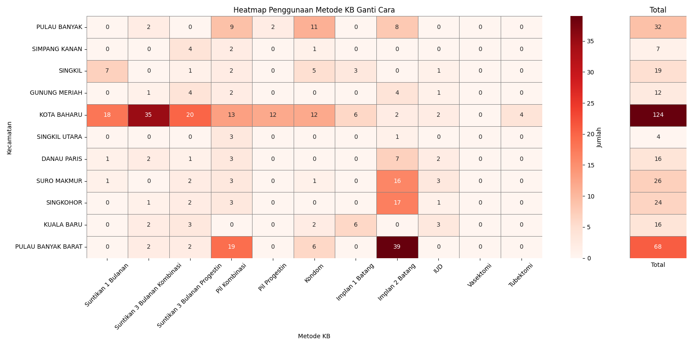

# Visualisasi Data: Peserta KB Ganti Cara di Kabupaten Aceh Singkil

Proyek ini menyajikan **visualisasi data KB Ganti Cara** untuk setiap kecamatan di Kabupaten Aceh Singkil. Dataset mencakup jumlah peserta dan jenis metode kontrasepsi yang digunakan.

## Hasil Visualisasi

1. **Bar Chart Horizontal**

   * Menampilkan jumlah peserta KB Ganti Cara per kecamatan.
   * Visual ini memudahkan identifikasi kecamatan dengan peserta terbanyak dan paling sedikit.
   * 

2. **Stacked Bar Chart**

   * Menunjukkan distribusi jenis kontrasepsi yang digunakan dalam program KB Ganti Cara di tiap kecamatan.
   * Setiap warna mewakili metode yang berbeda.
   * 

3. **Heatmap + Kolom Total**

   * Heatmap menyoroti jumlah peserta menurut metode dan kecamatan.
   * Ditambah kolom "Total" untuk melihat jumlah keseluruhan dari tiap kecamatan.
   * 

## Tujuan

Visualisasi ini bertujuan membantu:

* Dinas terkait untuk \*\*melihat distribusi dan efektivitas metode
