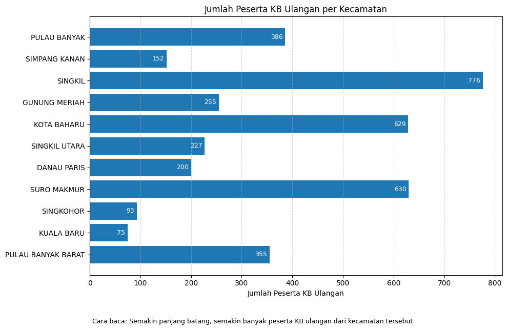
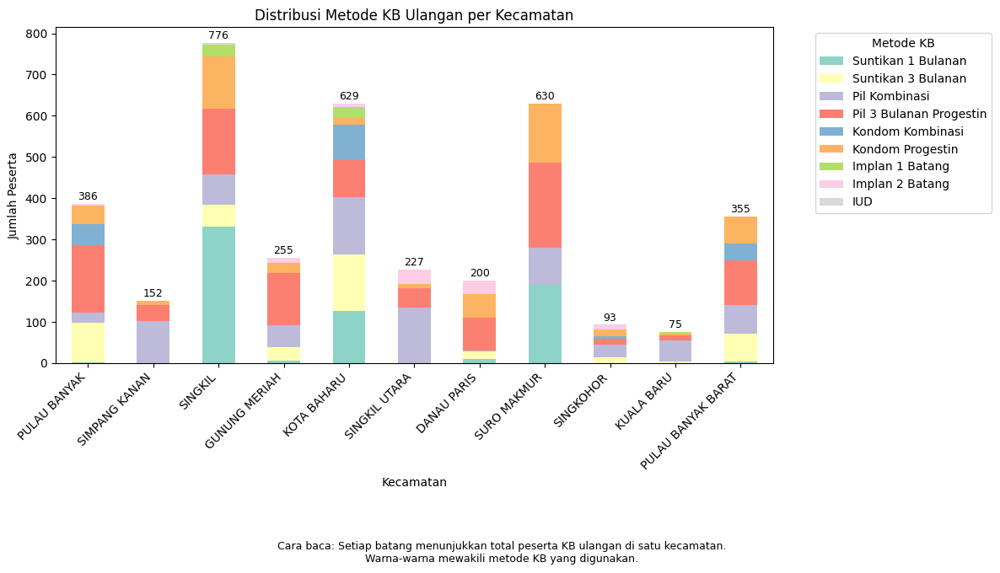
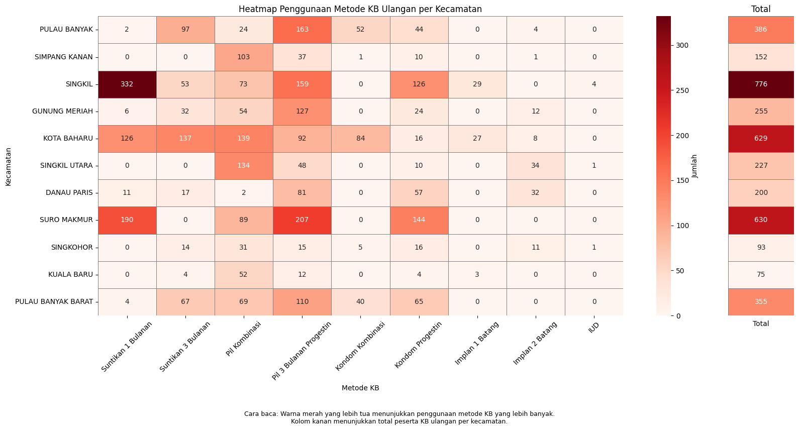

# Visualisasi Data Peserta KB Ulangan di Kabupaten Singkil

Proyek ini menyajikan visualisasi data peserta KB ulangan berdasarkan kecamatan dan metode kontrasepsi yang digunakan di Kabupaten Singkil.

## Hasil Visualisasi

1. **Jumlah Peserta KB Ulangan per Kecamatan**

   * Grafik batang horizontal yang menunjukkan banyaknya peserta KB ulangan di masing-masing kecamatan.
   * Kecamatan dengan jumlah peserta terbanyak adalah SINGKIL.

   

2. **Distribusi Penggunaan Metode KB Ulangan**

   * Grafik batang bertumpuk yang menampilkan beragam metode KB yang digunakan di setiap kecamatan.
   * Memberikan gambaran proporsi metode yang paling dominan.

   

3. **Heatmap Penggunaan Metode KB Ulangan**

   * Visualisasi intensitas penggunaan masing-masing metode KB di tiap kecamatan.
   * Warna lebih gelap menandakan jumlah yang lebih banyak.
   * Termasuk strip total di sisi kanan yang menampilkan total peserta dari tiap kecamatan.

   

## Tujuan

Membantu memahami pola penggunaan layanan KB ulangan secara visual, sederhana, dan informatif berdasarkan data per kecamatan.

> Visualisasi ini dapat digunakan untuk mendukung analisis program KB lanjutan dan perencanaan layanan di Kabupaten Singkil.
